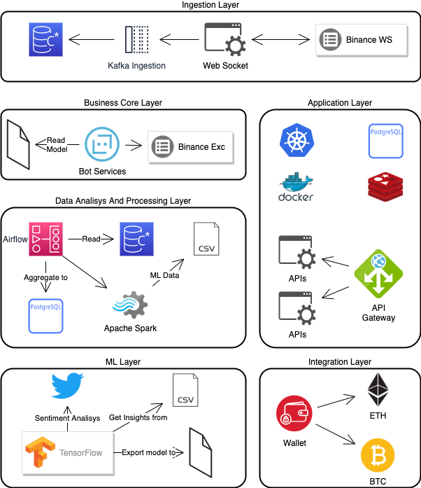

# Mercury

Il progetto ha i seguenti componenti:

- [Mercury Timeseries Ingestor](https://github.com/FedericoSerini/bot)
- [Mercury Trading Bot](https://github.com/FedericoSerini/bot)
- [Mercury UI](https://github.com/FedericoSerini/bot)(?)
- [Mercury API](https://github.com/FedericoSerini/bot)
- [Mercury API Gateway](https://github.com/FedericoSerini/bot)
- [Mercury ML Core](https://github.com/FedericoSerini/bot)
- [Mercury Wallet Integration](https://github.com/FedericoSerini/bot)
- [Mercury Big Data](https://github.com/FedericoSerini/bot)
- [Mercury Fake Data Generator](https://github.com/FedericoSerini/bot)
- [Mercury Data Generator](https://github.com/FedericoSerini/bot)
- [Mercury Sentiment Analysis Engine](https://github.com/FedericoSerini/bot)
### Architettura

L'architettura proposta nella fase 1 prevede 6 strati:

- Ingestion: Tutto quello che riguarda la costruzione della base dati su cui si appoggia la piattaforma, nello stato iniziale si sfrutteranno i web socket messi a disposizione da Binance per quanto riguarda le timeseries di trading. Il tutto verrà caricato sulla base dati Cassandra mediante il message broker kafka che in questo caso svolgerà esclusivamente la funzione di motore di ingestione dati.
- Business Core: Lo strato effettivo su cui punta la piattaforma, ovvero trading basato su ML mediante modelli addestrati da altri strati.
- Application: Tutto quello che riguarda interfacce visive, API ecc..
- Data Analisys And Processing: Strato fondamentale che svolge la funzione di collante tra tutti gli strati, infatti questo strato si occupa di analisi e aggregazione dati
- ML: Questo strato si occupa di generare modelli ML a partire dai dati elaborati e dall'analisi del sentimento (mediante API twitter)
- Integration: Integrazione dei vari wallet su più blockchain

### Tech stack

Linguaggi: Java, Go, Python, Javascript (Node.js)

Database: Cassandra

Caching: Redis

Data Ingestion/Pub Sub: Kafka 

Workflow management: Airflow

Big Data: Spark

Container: Docker

CI/CD: Jenkins

IAM: Keycloak

Versionamento: GitHub

